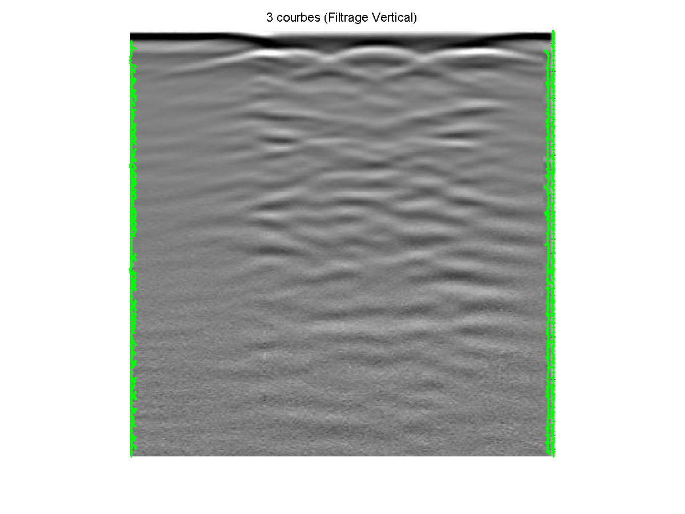
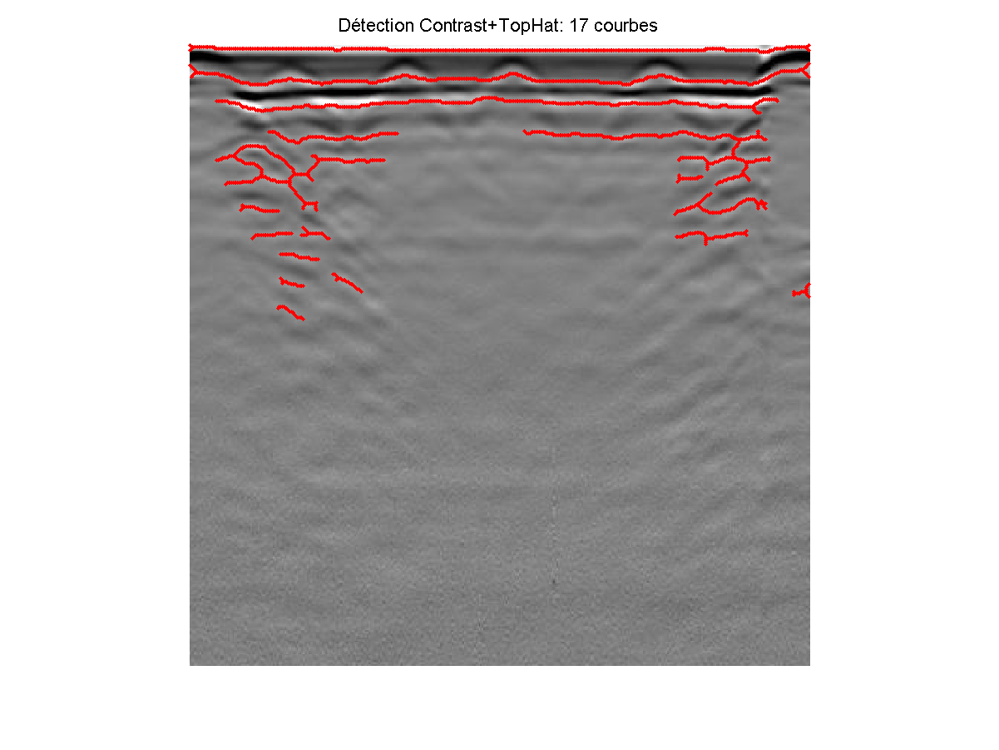
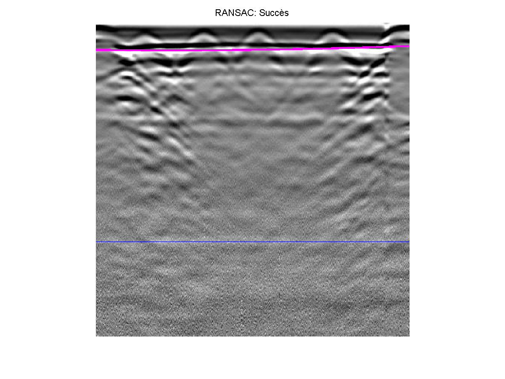
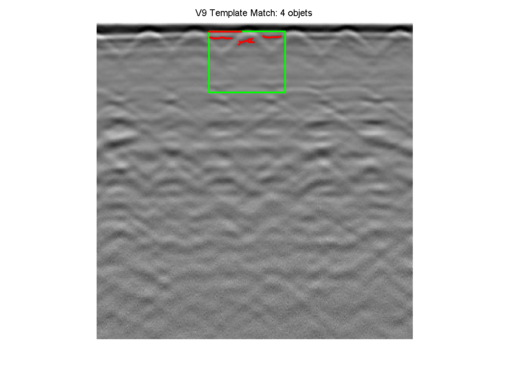
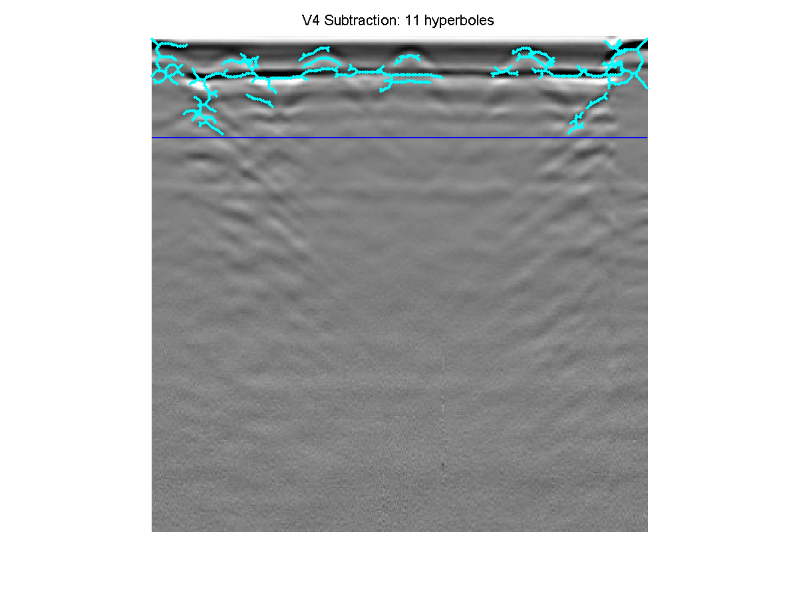

# Automated GPR Hyperbola Detection: From Signal Processing to Deep Learning

## 📄 Project Overview
This project addresses the challenge of detecting hyperbolic signatures (buried objects) in high-noise Ground Penetrating Radar (GPR) imagery. 

Moving beyond simple edge detection, we developed a hybrid pipeline that combines **Classical Signal Processing** (for automated data annotation) with **Deep Learning** (YOLOv8) for robust inference.

## 🛠️ Methodology

### 1. The Engineering Challenge (Failure Analysis)
GPR images are signal maps, not photographs. Traditional Computer Vision methods failed due to texture noise and surface reflections.

| Approach | Result | Why it failed |
| :--- | :---: | :--- |
| **Edge Detection** |  | **Over-sensitivity:** Detected soil texture (grain) as edges. |
| **Morphology** |  | **Clutter:** Highlighted horizontal strata indiscriminately. |
| **RANSAC** |  | **Surface Trap:** The algorithm locked onto the surface reflection instead of the hyperbole. |
| **Template Match** |  | **Rigidity:** Fixed templates could not adapt to varying soil velocities. |

### 2. The Solution: Smart Pre-Processing
We achieved robust auto-detection using a custom algorithm:
* **Smart Crop:** Calculates row-wise Standard Deviation to remove static noise at the bottom.
* **Background Subtraction:** Removes horizontal soil strata (`Img - Mean(Img)`).
* **Geometric Filtering:** Filters objects based on aspect ratio and size.

**Result (Auto-Labeling Source):**

### 3. Mathematical Interpolation
Detected points are interpolated to form continuous mathematical curves, allowing for Error Mean Relative (EMR) calculation.
* **Linear:** Low error, angular.
* **Spline:** Lowest error, high fidelity.
* **Polynomial (Deg 3):** Best physical representation of a hyperbole.

### 4. The AI Transition (Method 2)
Using the MATLAB results as a "Pseudo-Labeling" mechanism, we generated a synthetic dataset to train a **YOLOv8 Nano** model.
* **Training Platform:** Google Colab (Nvidia T4 GPU)
* **Precision (mAP50):** > 0.85
* **Inference Speed:** Real-time (GPU)

## 📂 Repository Structure
* `src/matlab`: Core detection and interpolation algorithms.
* `src/python`: YOLOv8 training notebook (Google Colab).
* `results`: Generated CSV metrics and trained model weights (`best.pt`).
* `assets`: Visualization of algorithm performance.

## 🚀 How to Run
1.  **MATLAB:** Run `init_project.m` to setup folders, then `detect_hyperboles.m`.
2.  **Python:** Upload `src/python/gpr_yolo_training.ipynb` to Google Colab to reproduce training.

---
*University Project - Fall 2025*"# GPR-Hyperbola-Detection" 
